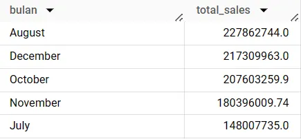
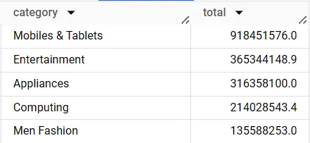
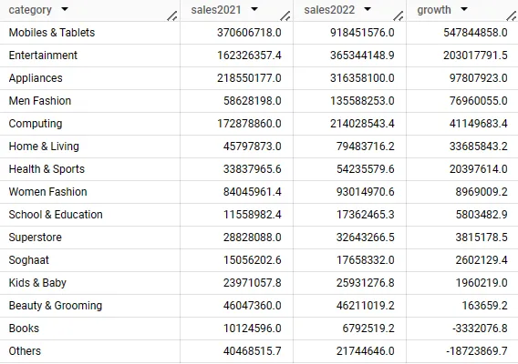
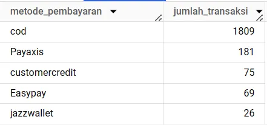
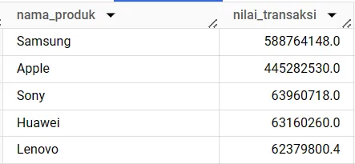

# E-Commerce-SQL-Analysis

Dataset yang digunakan pada project ini adalah dataset yang diperoleh dari project akhir Bootchamp Data Analis oleh MySkill. Project ini menggunakan dataset Ecommerce Tokopaedi(data dummy) ini berisi transaksi dari bulan Januari 2021 sampai bulan Desember 2022. Dataset terdidri dari:
1.  order_detail, berisi detail data order yang terdiri dari:
      * id → angka unik dari order / id_order
      * customer_id → angka unik dari pelanggan
      * order_date → tanggal saat dilakukan transaksi
      * sku_id → angka unik dari produk (sku adalah stock keeping unit)
      * price → harga yang tertera pada tagging harga
      * qty_ordered → jumlah barang yang dibeli oleh pelanggan
      * before_discount → nilai harga total dari produk (price * qty_ordered)
      * discount_amount → nilai diskon product total
      * after_discount → nilai harga total produk ketika sudah dikurangi dengan diskon
      * is_gross → menunjukkan pelanggan belum membayar pesanan
      * is_valid → menunjukkan pelanggan sudah melakukan pembayaran
      * is_net → menunjukkan transaksi sudah selesai
      * payment_id → angka unik dari metode pembayaran
2.  sku_detail, berisi detail sku/produk yang terdiri dari:
      * id → angka unik dari produk (dapat digunakan untuk key saat join)
      * sku_name → nama dari produk
      * base_price → harga barang yang tertera pada tagging harga / price
      * cogs → cost of goods sold / total biaya untuk menjual 1 produk
      * category → kategori produk
3.  customer_detail, yang berisiskan detail dari customer yang terdiri dari:
      * id → angka unik dari pelanggan
      * registered_date → tanggal pelanggan mulai mendaftarkan diri sebagai anggota
4.  payment_detail, yang berisikan detail dari pembayaran yang terdiri dari:
      * id → angka unik dari metode pembayaran
      * payment_method → metode pembayaran yang digunakan

  ## Case Study
  1. Selama transaksi yang terjadi selama 2021, pada bulan apa total nilai transaksi (after_discount) paling besar?
     
     
     
     Berdasarkan tabel yang telah didapat, pada tahun 2021 nilai transaksi paling besar berada pada bulan Agustus sebesar        227862744.0
     
  2. Selama transaksi pada tahun 2022, kategori apa yang menghasilkan nilai transaksi paling besar?

     
     
     kagetori yang menghasilkan nilai transaksi paling besar, yaitu kategori Mobiles & Tablets sebesar 918451576.0
     
 3. Bandingkan nilai transaksi dari masing-masing kategori pada tahun 2021 dengan 2022. Sebutkan kategori apa saja yang         mengalami peningkatan dan kategori apa yang mengalami penurunan nilai transaksi dari tahun 2021 ke 2022.

     
     
     Berdasarkan tabel yang diperoleh di atas terdapat 13 kategori yang mengalami peningkatan, tiga teratas yang menalami        peningkatan adalah kategori mobiles & Tablets, Entertainment dan Appliances. Sedangkan terdapat dua kategori yang           mengalami penurunan yaitu kategori Books dan kategori Others.

  4. Tampilkan top 5 metode pembayaran yang paling populer digunakan selama 2022! (berdasarkan total unique order)

     
     
     Top 5 metode pembayaran paling populer yang digunakan selama tahun 2022 secara berurutan dari yang terbesar jumlah          transaksinya, yaitu COD, Payaxis, Customercredit, Easypay dan Jazzwallet

5.  Urutan produk berdasarkan nilai transaksinya (Samsung, Apple, Sony, Huawei, Lenovo)

     
     
     produk Samsung berada diurutan pertama dengan nilai transaksi 588764148.0 diikuti oleh Apple sebesar 445282530.0, lalu      Sony sebesar 63960718.0, Huawei sebesar 63160260.0 dan Lenovo diperingkat ke-lima dengan nilai transaksi 62379800.4.
